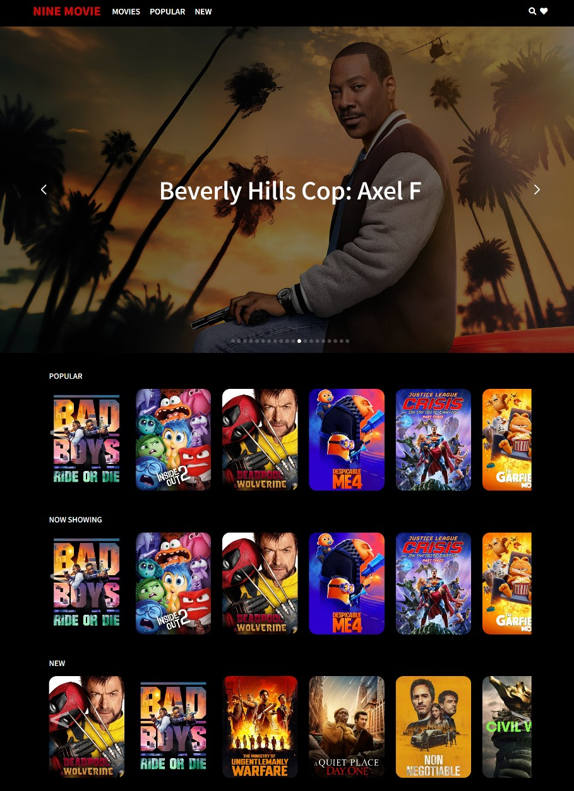

# 🎬 NINE MOVIE

<!--  -->

### [🍿 NINE MOVIE Website(KR) 🍿](https://ninemovie.netlify.app/)
### [🍿 NINE MOVIE Website(EN) 🍿](https://ninemovienew.netlify.app)

 

## Sprint Role Allocation

| Team Member                                  | Role                        |
| ----------------------------------------     | --------------------------  |
| [Hyun-woo Kim](https://github.com/khwww)     | Product Owner/Scrum master  |
| [Je-hyeok Song](https://github.com/song2805) | Developers                  |
| [Heejung Lee](https://github.com/victoryalhj)| Developers                  |
| [Seong-sook Hong](https://github.com/SSUK-H) | Developers                  |

 

## Sprint Schedule

- **Sprint Duration**: 15.07.2024 ~ 24.07.2024 (1 Week)
- **Daily Scrum**:  Every day at 12:00 PM (1 Hour)

 

## Product Backlog

| Team Member                                   | Assigned Feature                                         |
| ----------------------------------------------| -------------------------------------------------------- |
| [Heejung Lee](https://github.com/victoryalhj) | Content Search and Results Display                       |
| [Je-hyeok Song](https://github.com/song2805)  | Slideshow and Recommended Content Feature                |
| [Hyun-woo Kim](https://github.com/khwww)      | Content Detail Page (Related Content and YouTube Videos) |
| [Seong-sook Hong](https://github.com/SSUK-H)  | Favorite Add/Remove Feature and State Management         |

 

### API

- TMDB API: https://developer.themoviedb.org/docs/getting-started
- YouTube Data API: https://developers.google.com/youtube/v3/docs?hl=ko

 

### Feature Details

1. **Contents Search and Results Display**
   - Implement search input field and button
   - Display search results through API calls
2. **Slideshow and Recommended Content**
   - Implement slideshow (automatic/manual transitions)
   - Display list of recommended content
3. **Content Detail Page**
   - Show details like ratings, genres, cast
   - Display related content (slideshow) and related YouTube videos
4. **Favorite Add/Remove Feature**
   - Implement favorite button for content
   - Manage state using local storage

 

## User Story

1. **Content Search**
   - Users must be able to search for content
   - They should enter a search term and click the search button
   - Results should be displayed as a list of matching content
2. **Slideshow View**
   - Users should be able to view recommended content in a slideshow format
   - The slideshow should include both automatic and manual controls
3. **Detail Page**
   - Users should be able to view detailed information about selected content
   - Related content should be displayed in a slideshow format
   - Users should be able to view and play related YouTube videos
4. **Favorite Management**
   - Users should be able to add content to their favorites
   - They should be able to remove content from the favorites list
   - Favorite status should be stored in local storage and persist across sessions

### Additional Considerations

- All features should be intuitive and easily accessible for user convenience
- The design should be responsive, working well across various screen sizes
- Use animations and transition effects appropriately to enhance the user experience
